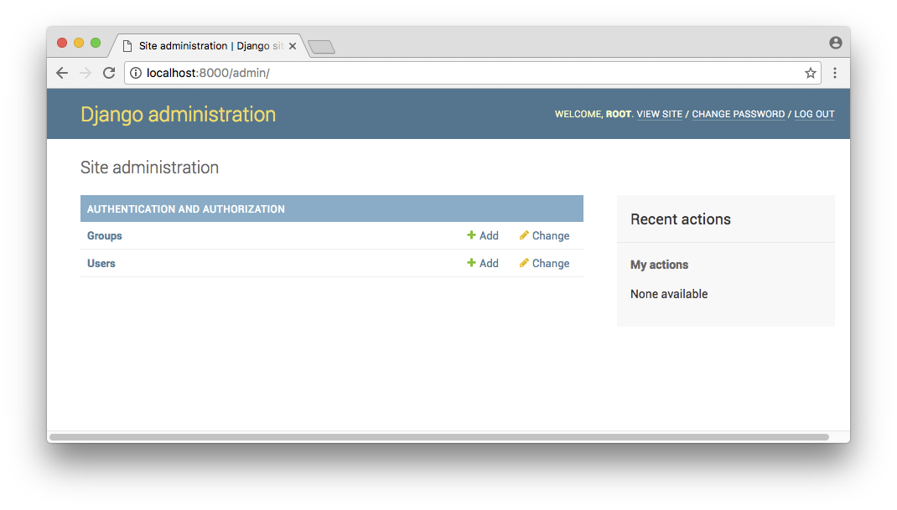

*Note: safety-django is currently in it's early stages. It's probably no even installable and likely that there are some false positives and missing packages.*

[](https://pypi.python.org/pypi/safety-django)
[](https://travis-ci.org/pyupio/safety-django)

# About

Safety for Django checks your installed dependencies for known security vulnerabilities and displays them in the admin area.

# Installation

Install `safety-django` with pip:

```
pip install safety-django
```

and add it to your `INSTALLED_APPS`, before `django.contrib.admin`

```
INSTALLED_APPS = [
    'safety_django',
    'django.contrib.admin',
]
```

# Screenshots




# Support

If you are using `safety` in one of your projects, please consider getting a paid
[pyup.io](https://pyup.io) account. This is what makes projects like this possible.
